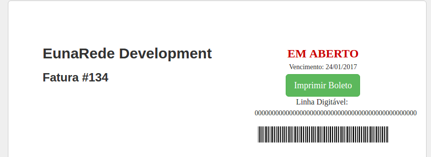

# Iugu WHMCS Pro

Este módulo foi últil para você? Mostre sua gratidão contribuindo com um choop, café ou até mesmo um salto de paraquedas!

* [Requerimentos](https://github.com/eunarede/iugu-whmcs-pro/wiki/Requerimentos)
* [Instalação](https://github.com/eunarede/iugu-whmcs-pro/wiki/instalacao)

O Módulo para [WHMCS] Iugu Pro desenvolvido pela [EunaRede] proporciona uma integração completa e transparente com o gateway de pagamento [Iugu]

Este módulo consiste em dois métodos de pagamento diferentes, boleto bancário e cartão de crédito, confira os recursos a seguir:

## Módulo Cartão de Crédito

Assita um video demonstrando as funcionalidades do módulo cartão de crédito em [https://youtu.be/00dDINuXT1g](https://youtu.be/00dDINuXT1g)

Através do método de pagamento por cartão de crédito do Módulo [WHMCS] Iugu Pro, é possível realizar o recebimento de faturas via cartão de crédito diretamente no [WHMCS], sem necessidade de redirecionamento. O módulo utiliza os campos originais de cartão de crédito do [WHMCS] sem necessidade de modificação no tema.

Ao realizar um pedido ou na atualização do cartão de crédito no perfil de um cliente já existente, o módulo captura os dados do cartão e utilizando a API da Iugu, gera um código único criptogrado: o token de pagamento.

Os dados do cartão de crédito são criptografados e armazenados nos servidores da Iugu, gerando um token de representação destes dados, que são atrelados ao cliente dentro do sistema da Iugu. Este token então é armazenado no [WHMCS] e vinculado a conta do cliente no [WHMCS].

Através do token de pagamento, o [WHMCS] poderá realizar capturas automáticas de pedidos e cobranças recorrentes de faturas no cartão de crédito. O [WHMCS] armazena apenas a data de vencimento do cartão, os 4 últimos digitos e bandeira (estas informações são utilizadas para alertas de vencimento do cartão).

### Com este módulo você poderá:

* Realizar a cobrança da fatura sem redirecionar o cliente para o site da Iugu;
* Capturar os cartão de crédito de forma transparente;
* Capturar faturas recorrentes automaticamente;
* Cadastrar o cliente do [WHMCS] na Iugu automaticamente;
* Excluir o cliente na Iugu quando excluido no [WHMCS];
* Atualizar os dados do cartão do cliente diretamente no [WHMCS];

## Módulo Boleto Bancário

Através do método de pagamento por boleto bancário do Módulo [WHMCS] Iugu Pro, é possível gerar o boleto diretamente no WHMCS, sem necessidade de redirecionamento.

### Com este módulo você poderá:

* Gerar o boleto sem redirecionar o cliente para o site da Iugu;
* Dar baixa na fatura automaticamente após a compensação (retorno automático);
* Cadastrar o cliente do [WHMCS] na Iugu automaticamente;
* Excluir o cliente na Iugu quando excluido no [WHMCS];

## Atualização do Cartão de Crédito

Atualize o cartão de crédito do cliente diretamente no perfil do [WHMCS].

Assista o [vídeo de demonstração](https://youtu.be/dqzsNcbA-Gg).

## Instalação

Estamos constantemente aprimorando este módulo e enriquecendo sua documentação. Para acessar a documentação de instalação, veja nossa [Wiki]

## Requerimentos

Veja os requerimentos necssários para este módulo acessando nossa [Wiki]

## Créditos e isenções

Este módulo é entregue "como está", a EunaRede ou sua equipe não se responsabilizam por qualquer eventual projuízo ou perda de qualquer natureza que este plugin ou a sua utilização possam estar associados.

A EunaRede e nenhum de seus membros estão associados ou vinculados de alguma maneira com a Iugu. Este desenvolvido é de livre iniciativa e independente.

[EunaRede]: https://www.eunarede.com
[Iugu]: https://iugu.com
[WHMCS]: https://www.whmcs.com/members/aff.php?aff=4571
[Wiki]: https://github.com/eunarede/iugu-whmcs-pro/wiki
