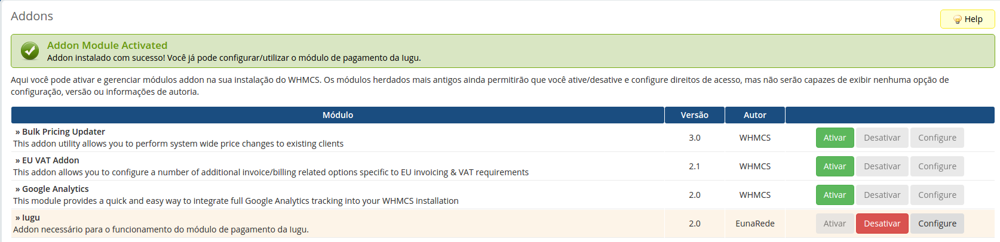
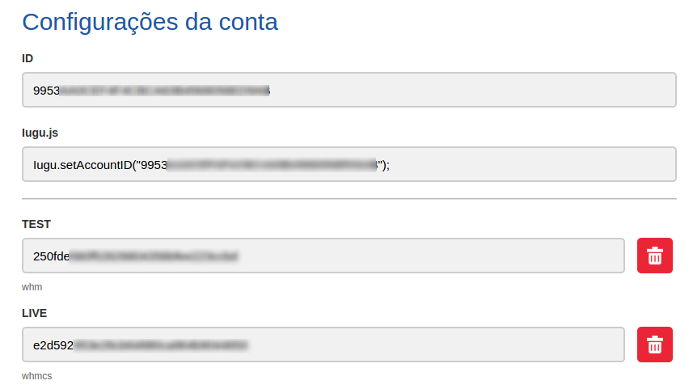

Passos para a instalação, documentação em desenvolvimento.

## 1 - Adicionar novo usuário para o módulo

O Módulo WHMCS Iugu Pro necessita de acesso a API interna do WHMCS. Para facilitar o processo de utilização e manter as boas práticas de segurança e gestão de identidades, crie um usuário para o módulo em **Opções** >> **Staff Management** >> **Administradores**.
Clique em **Adicionar Novo Administrador** e especifique os seguintes parametros do novo usuário:

* Função do Administrador: **Full Administrator**
* Primeiro Nome: de sua preferência
* Sobrenome: de sua preferencia
* Email: insira um endereço válido de preferência
* Nome de Usuário: **iugupro** (não altere este nome de usuário)
* Senha: o intuito deste usuário não é para utilização através do portal, insira uma senha complexa

Os demais campos são opcionais.

## 2 - Ative o módulo addon

O Iugu para WHMCS requer a ativação do módulo addon que acompanha este módulo. Este addon é responsável por gerar as tabelas necessárias no banco de dados para registro das cobranças e clientes.

Vá para **Opções** >> **Módulos Addons** e ative o módulo **Iugu**.

Após a ativação do módulo, acesse sua configuração e prencha os campos:

* Número da Conta Iugu: encontre seu número de conta Iugu em **Administração** >> **Configurações da conta**
* Token da API Iugu: insira seu token ou gere um para o WHMCS

> Utilize um Token da versão LIVE para o ambiente de produção e TEST para ambiente de homologação
